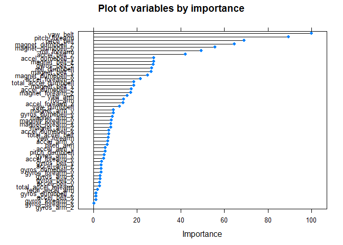

# Correct exercise analysis


##Introduction
Using devices such as Jawbone Up, Nike FuelBand, and Fitbit it is now possible to collect a large amount of data about personal activity relatively inexpensively. These type of devices are part of the quantified self movement - a group of enthusiasts who take measurements about themselves regularly to improve their health, to find patterns in their behavior, or because they are tech geeks. One thing that people regularly do is quantify how much of a particular activity they do, but they rarely quantify how well they do it. In this project, I use data from accelerometers on the belt, forearm, arm, and dumbell of 6 participants to predict whether they performed the exercise correctly. They were asked to perform barbell lifts correctly and incorrectly in 5 different ways. More information is available from the website here: http://groupware.les.inf.puc-rio.br/har (see the section on the Weight Lifting Exercise Dataset).  

The data includes a 'classe' variable which has 5 levels (A->E), where A is the correct exercise and B->E are incorrect variants of the exercise. I aim to create a model for predicting the classe variable from the data and test the models accuracy.
  
##Exploratory Data Analysis
Here I load the data set into a training and testset and look at the first 6 rows.  
  

```r
train_url <- "https://d396qusza40orc.cloudfront.net/predmachlearn/pml-training.csv"
test_url <- "https://d396qusza40orc.cloudfront.net/predmachlearn/pml-testing.csv"
train<- read.csv(text=getURL(train_url), na.strings=c("", "NA"), row.names = 1)
test<- read.csv(text=getURL(test_url), na.strings=c("", "NA"), row.names = 1)
head(train)
```
  
##Data Tidying
The first 6 rows showed a lot of variables that will not have any correlation to the classe variable I'm going to build a model for, namely id, user_name, raw_timestamp_part_1, raw_timestamp_part_,2 cvtd_timestamp, new_window, and  num_window (columns 1 to 7). I therefore delete these columns.  
  

```r
train<-train[,-(1:7)]
test<-test[,-(1:7)]
```
  
A lot of the columns appeared to show a lot of NAs. I first work out the proportion of NAs for each column, it turns out that a large number of columns are ~98% NAs. Consequently I remove these columns from the training and test sets.  
  

```r
sapply(train, function (x) {sum(is.na(x))/dim(train)[1]})
goodcol<-sapply(train, function (x) {(sum(is.na(x))/dim(train)[1])<0.9})
train<-train[,goodcol]
test<-test[,goodcol]
```
  
I now check to see whether any of the remaining columns have near zero values, which would affect model selection and creation. None of them do.  
  

```r
NZVs <- nearZeroVar(train, saveMetrics = TRUE)
length(which(NZVs$nzv==TRUE))
```

```
## [1] 0
```
  
##Model Creation and Selection
  
I first use cross validation and subset the training subset into a training and validation set so that I can work out the out of sample error on any models I train.I train two different models, one using generalised boosted regression and the other using random forests, and test their accuracy on the validation set.  
  

```r
subsample<-createDataPartition(y=train$classe,p=0.75,list=FALSE)
subTrain<-train[subsample,]
subVal<-train[-subsample,]
mod1<-train(classe~.,data=subTrain,method="gbm")
mod2<-train(classe~.,data=subTrain,method="rf")
predMod1<-predict(mod1,subVal)
predMod2<-predict(mod2,subVal)
```

```r
confusionMatrix(predMod1,subVal$classe)
```

```
## Confusion Matrix and Statistics
## 
##           Reference
## Prediction    A    B    C    D    E
##          A 1372   42    0    0    1
##          B   13  875   23    7   12
##          C    9   27  823   15   15
##          D    1    4    8  775    9
##          E    0    1    1    7  864
## 
## Overall Statistics
##                                           
##                Accuracy : 0.9602          
##                  95% CI : (0.9544, 0.9655)
##     No Information Rate : 0.2845          
##     P-Value [Acc > NIR] : < 2.2e-16       
##                                           
##                   Kappa : 0.9497          
##  Mcnemar's Test P-Value : 1.494e-07       
## 
## Statistics by Class:
## 
##                      Class: A Class: B Class: C Class: D Class: E
## Sensitivity            0.9835   0.9220   0.9626   0.9639   0.9589
## Specificity            0.9877   0.9861   0.9837   0.9946   0.9978
## Pos Pred Value         0.9696   0.9409   0.9258   0.9724   0.9897
## Neg Pred Value         0.9934   0.9814   0.9920   0.9929   0.9908
## Prevalence             0.2845   0.1935   0.1743   0.1639   0.1837
## Detection Rate         0.2798   0.1784   0.1678   0.1580   0.1762
## Detection Prevalence   0.2885   0.1896   0.1813   0.1625   0.1780
## Balanced Accuracy      0.9856   0.9541   0.9731   0.9793   0.9783
```

```r
confusionMatrix(predMod2,subVal$classe)
```

```
## Confusion Matrix and Statistics
## 
##           Reference
## Prediction    A    B    C    D    E
##          A 1389    7    0    0    0
##          B    3  935    5    0    0
##          C    3    6  845    6    3
##          D    0    1    5  798    0
##          E    0    0    0    0  898
## 
## Overall Statistics
##                                           
##                Accuracy : 0.992           
##                  95% CI : (0.9891, 0.9943)
##     No Information Rate : 0.2845          
##     P-Value [Acc > NIR] : < 2.2e-16       
##                                           
##                   Kappa : 0.9899          
##  Mcnemar's Test P-Value : NA              
## 
## Statistics by Class:
## 
##                      Class: A Class: B Class: C Class: D Class: E
## Sensitivity            0.9957   0.9852   0.9883   0.9925   0.9967
## Specificity            0.9980   0.9980   0.9956   0.9985   1.0000
## Pos Pred Value         0.9950   0.9915   0.9791   0.9925   1.0000
## Neg Pred Value         0.9983   0.9965   0.9975   0.9985   0.9993
## Prevalence             0.2845   0.1935   0.1743   0.1639   0.1837
## Detection Rate         0.2832   0.1907   0.1723   0.1627   0.1831
## Detection Prevalence   0.2847   0.1923   0.1760   0.1639   0.1831
## Balanced Accuracy      0.9969   0.9916   0.9919   0.9955   0.9983
```

Based on the results the model based on random forests is the most accurate at 99.23% and an out of sample error rate of 0.77%. I will use the random forest model since it is the most accurate of the two and it works well with a large number of variables, especially when the interactions between variables are unknown. To understand the model better I plot the importance of the variables it uses.


```r
plot(varImp(mod2), main = "Plot of variables by importance")
```



##Test Set Prediction

```r
predTest<-predict(mod2,test)
predTest
```

```
##  [1] B A B A A E D B A A B C B A E E A B B B
## Levels: A B C D E
```
